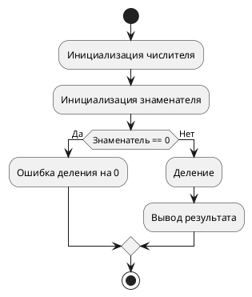

```plantuml

@startuml
start
:Инициализация числителя;
:Инициализация знаменателя;
if (Знаменатель == 0) then (Да)
:Ошибка деления на 0;
else (Нет)
:Деление;
:Вывод результата;
endif
stop
@enduml

```